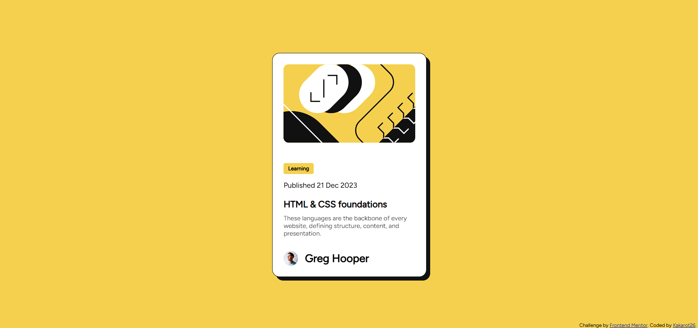

# 📰 Blog Preview Card — Frontend Mentor Challenge

This is my solution to the [Blog Preview Card challenge]() on Frontend Mentor. It's a clean, responsive card layout that showcases a blog post preview with hover effects and semantic structure.

## 🚀 Live Site  
Check out the hosted version here: [Live Preview](https://kakarot26.github.io/Blog-Preview-FM-Solution/)

## 🛠️ Built With
- HTML5
- CSS3
- Flexbox
- Custom fonts via `.ttf` files

## 📸 Screenshot

## 🎯 What I Learned
- How to implement hover and focus states for interactive elements
- Structuring semantic HTML for accessibility
- Using custom fonts from `.ttf` files via `@font-face`
- Responsive design tweaks without media queries

